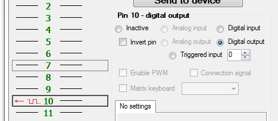
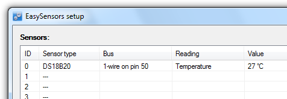
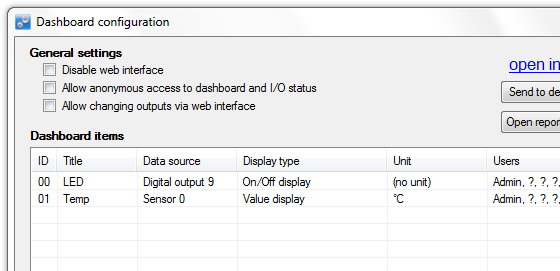
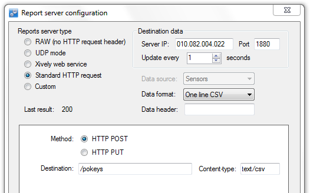
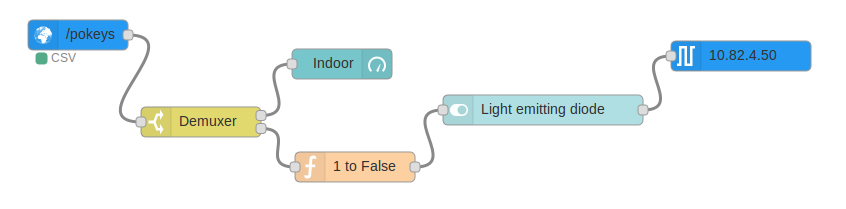
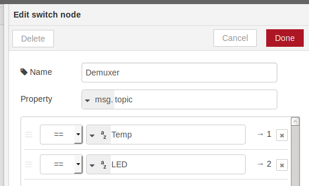
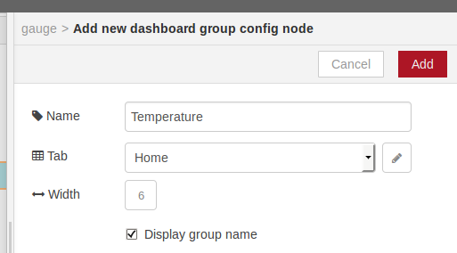
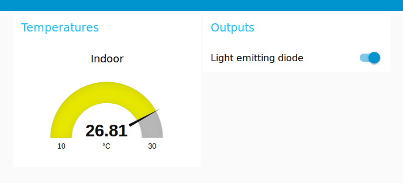
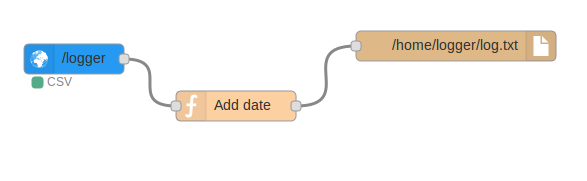
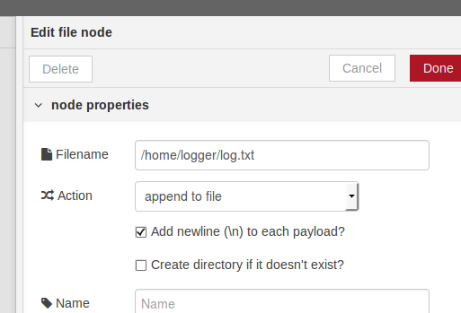

# Example 1 (show current values of sensors with control of an output)

In first example a DS18B20 temperature sensor is connected with data pin to a pin 50 (with a pull-up resistor of value 4k7 to 5 V). Moreover, a LED with 330 Ohm resistor is connected between pin 10 and 3.3 V, thus output state of 1 means the LED turned off and 0 turned on.

Our goal is to create a responsive web interface where we can see current temperature and toggle the LED on and off. Furthermore, we want feedback from Pokeys to see if output pin was really toggled. LED will be toggled by digital output plugin, and feedback with temperature received by reports plugin. User interface will be build from nodes provided by node-red-dashboard module.

### Pokeys configuration



In Pokeys configuration manager we make sure that pin 10 is set as output and DS18B20 is configured as Dallas 1-wire sensor in EasySensor dialog.



Before setting server report, a Pokeys web dashboard must be made out with our Sensor 1, named **Temp**, and output pin named **LED**. These names are arbitrary, but must be different from each other. Order of entries is not important.


Now we can configure report server. Our node plug-in acts as a web server, so a **Standard HTTP request** is needed. Server IP must be an IP where Node-RED is accessible (or will be accessible) and it is likely to be 192.168.1.200 or similar. Server port is also needed, as Node-RED mostly does not run on port 80. Usually it runs through 1880, so we need to enter **1880**. Data format is not mandatory, it could be anything since the plug-in detects and parses all three formats.

Method is **POST** and destination is simply `/pokeys`.



### Node-RED configuration

Make sure Node-RED is installed with modules: *node-red-contrib-pokeys* and [*node-red-dashboard*](https://github.com/node-red/node-red-dashboard), and it is running. Open Node-RED in web browser and design the following flow, consisting of *pokeys:reports*, *function:switch*, *dashboard:gauge*, *function:function*, *dashboard:switch* and *pokeys:digital*. Flow could be also imported to Node-RED from `flow1.json`.


Since we used `/pokeys` as destination, first node does not need any configuration. Second node will act as demuxer to divert messages depending of their topic. To do this double click the node and enter **msg.topic** as Property, and add two rules. First rule will fetch all messages with **Temp** topic, and second one with **LED**. These two names must be the same as in Pokeys dashboard configuration. At this point the node should get two output pins. Wire first output node to a input node of a gauge.


Setup gauge by double clicking and selecting **Add new ui_group** in *Group* dropdown menu. Then click pencil on the right, enter name **Temperature** and click *Add*.



At the end edit gauge's *Label* and *Unit* fields.

Connect second (lower) pin of the demuxer to *function*, which will invert value. Value of 1 will become false, and value of 0 true. This could be done by following function:
```
msg.payload = (msg.payload !== 1);
return msg
```
This is needed since value 1 means LED turned off and we need boolean values for switch to work.

Wire output of previous function to *dashboard:switch*, which will represent a switch on a dashboard. At configuration again add new group and untick **If msg arrives on input, pass through to output** and choose **Switch icon shows state of the input**, so that it will show pin status from feedback.

Since we want to control output, wire output of the switch to a digital node, where define output pin **10** and set IP number of the Pokeys device.

At the end open Node-RED dashboard UI by clicking *dashboard* pane on the right side of the webpage and then a box with arrow below, next to tabs.



# Example 2 (logging current values from a sensor)

In this example we need only one sensor connected to Pokeys device and configured as EasySensor.

### Pokeys configuration
Pokeys configuration is almost the same as in Example 1, except the destination of server reports is now `/logger`.

### Node-RED configuration
The flow consists of *pokeys:reports*, *function:function* and *storage:file*.



Since we changed the destination in Pokeys server configuration, we need to change URL of the first node to match.

The purpose of function in to insert a timedate stamp and filter messages, so that only values of sensor named **Temp** (topic Temp), will pass the function. This could be implemented as follows.
```
if (msg.topic !== 'Temp')
  return;
var newmsg = {};
var now = new Date();
newmsg.payload = now.toUTCString() + ',' + msg.payload;
return newmsg;
```
If sensor's value is only value Pokeys is sending to Node-RED server, we can skip function and connect just *pokeys:reports* with *storage:file* node.

In the last *file* node, we need specify full path of output file where we want to have values.


Since we are running Node-RED on Linux as user `logger`, we have permissions to save a file in his home directory.
